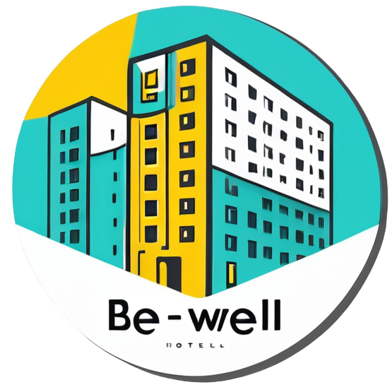

# 🏨 Hotel Be Well

A modern, full-featured hotel booking platform built with React and TypeScript. Experience seamless hotel discovery, booking management, and user-friendly interfaces designed for both travelers and hotel administrators.



## ✨ Features

### 🔍 **Hotel Discovery**

- Advanced search with filters (location, price, rating, amenities)
- Featured hotels showcase
- Popular destinations exploration
- Detailed hotel pages with image galleries and amenities

### 📅 **Booking Management**

- Intuitive booking flow with date selection
- Real-time pricing and availability
- Order tracking and management
- User dashboard with booking history

### 👤 **User Experience**

- Secure authentication system
- User profiles and preferences
- Booking statistics and analytics
- Responsive design for all devices

### 📰 **Content & Information**

- Travel articles and guides
- Customer testimonials
- FAQ section
- About page with company information

### 🎨 **Modern UI/UX**

- Clean, professional design
- Smooth animations and transitions
- Accessible components
- Dark/light theme support

## 🚀 Tech Stack

- **Framework**: React 18 with TypeScript
- **Build Tool**: Vite
- **Styling**: Tailwind CSS
- **UI Components**: shadcn/ui + Radix UI
- **State Management**: Zustand
- **Routing**: React Router Dom
- **Charts**: Recharts
- **Icons**: Lucide React
- **Date Handling**: date-fns

## 📂 Project Structure

```
src/
├── components/          # React components
│   ├── ui/             # Reusable UI components (shadcn/ui)
│   └── dashboard/      # Dashboard-specific components
├── pages/              # Page components and routing
├── hooks/              # Custom React hooks
├── store/              # State management (Zustand)
├── lib/                # Utilities and helpers
└── types/              # TypeScript type definitions
```

## 🛠️ Getting Started

### Prerequisites

- Node.js 18+ and npm/yarn
- Git

### Installation

1. **Clone the repository**

```bash
git clone <repository-url>
cd room-roam-booking-main
```

2. **Install dependencies**

```bash
npm install
```

3. **Start development server**

```bash
npm run dev
```

4. **Open your browser**
   Navigate to `http://localhost:5173`

### Available Scripts

```bash
# Development
npm run dev          # Start dev server
npm run build        # Build for production
npm run preview      # Preview production build
npm run lint         # Run ESLint

# Type checking
npm run type-check   # TypeScript type checking
```

## 🏗️ Key Components

### **Core Pages**

- **Homepage**: Hotel search, featured properties, testimonials
- **Hotel Listing**: Search results with advanced filtering
- **Hotel Details**: Comprehensive hotel information and booking
- **User Dashboard**: Booking management and user statistics
- **Articles**: Travel guides and blog content

### **UI Components**

Built with shadcn/ui for consistency and accessibility:

- Forms and inputs with validation
- Data tables and pagination
- Modal dialogs and drawers
- Charts and data visualization
- Navigation and breadcrumbs

### **State Management**

- **Auth Store**: User authentication and profile
- **Booking Store**: Booking data and preferences
- **UI Store**: Theme, notifications, and app state

## 🎯 Features in Detail

### Hotel Search & Filtering

- Location-based search
- Price range filtering
- Star rating selection
- Amenity filtering (WiFi, Pool, Spa, etc.)
- Sort by price, rating, popularity

### Booking Flow

1. Hotel selection and room choice
2. Date selection with availability check
3. Guest information and special requests
4. Payment integration (mock)
5. Confirmation and booking management

### User Dashboard

- Booking history and status
- Spending analytics with charts
- Profile management
- Favorite hotels
- Travel statistics

## 🔧 Configuration

### Environment Variables

Create a `.env.local` file:

```env
VITE_API_URL=your_api_url
VITE_PAYMENT_KEY=your_payment_key
```

### Customization

- **Theming**: Modify `tailwind.config.ts` for custom colors
- **Components**: Extend `src/components/ui/` for new UI elements
- **Routing**: Update `src/pages/Index.tsx` for new routes

## 📱 Responsive Design

Fully responsive design supporting:

- Desktop (1024px+)
- Tablet (768px - 1023px)
- Mobile (320px - 767px)

## 🧪 Testing

```bash
npm run test         # Run unit tests
npm run test:e2e     # Run end-to-end tests
npm run test:coverage # Generate coverage report
```

## 🚀 Deployment

### Production Build

```bash
npm run build
```

### Deploy to Various Platforms

- **Vercel**: `vercel --prod`
- **Netlify**: Drag & drop `dist/` folder
- **GitHub Pages**: Use GitHub Actions

## 🤝 Contributing

1. Fork the repository
2. Create a feature branch (`git checkout -b feature/amazing-feature`)
3. Commit your changes (`git commit -m 'Add amazing feature'`)
4. Push to the branch (`git push origin feature/amazing-feature`)
5. Open a Pull Request

## 📄 License

This project is licensed under the MIT License - see the [LICENSE](LICENSE) file for details.

## 🙏 Acknowledgments

- [shadcn/ui](https://ui.shadcn.com/) for the beautiful UI components
- [Lucide](https://lucide.dev/) for the icon library
- [Tailwind CSS](https://tailwindcss.com/) for the utility-first CSS framework
- [Radix UI](https://www.radix-ui.com/) for accessible component primitives

---

**Hotel Be Well** - Making hotel booking simple, beautiful, and efficient. ✈️🏨
